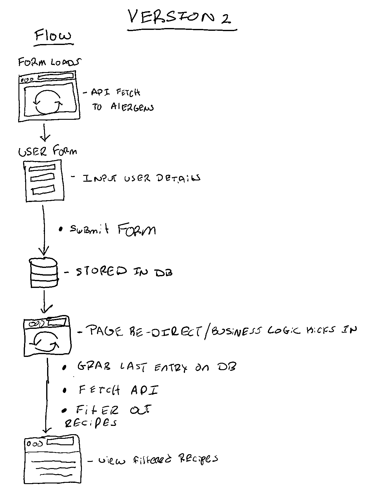

## Description
>A feature to help TinyOrganics filter out recipes that do NOT contain any ingredients that a child is allergic to. Mock API's for recipes and allergens provided by TinyOrganics..

### Live Demo
[https://agile-gorge-80097.herokuapp.com/](https://agile-gorge-80097.herokuapp.com/)

### Process


### Stories Completed
1. As a new Customer, I should be able to access the home page which contains a form which I will enter my information such as:
   - first name 
   - last name
   - email
   - child's first name
   - child's last name
   - any allergies

2. As a new Customer , I should be given a list of recipes that do NOT contain any ingredients that my child is allergic to. 

### API End Points
- To fetch the list of recipes , make a GET request to 
    - https://60f5adf918254c00176dffc8.mockapi.io/api/v1/recipes/

- To fetch the list of allergens, make a GET request to  
    - https://60f5adf918254c00176dffc8.mockapi.io/api/v1/allergens/
### Tech Stack
##### ```Scaffolding```
- The Django template language 
##### ```Web Framework```
- Python
- Django
##### ```Deployment/Hosting Infrastructure```
- Heroku
### Future Improvements
- Update form page to reload on __init__ vs HTTP page reload
- Include bread crumbs for ease of navigation for user
- Move Frontend consumption from Django templating to React
- Add unit test
- Hide form data on form submission
- Add form validation
Add confirmation message after submit
- Add loading state on redirect to recipe page
- 

### Help from the Twitter community
 - [Help with ModuleNotFoundError](https://twitter.com/builtByGetroman/status/1420869568097136643)
- [.gitignore and Heroku Procfile Question](https://twitter.com/builtByGetroman/status/1427114717345107969)
- [Installing Django on Heroku Dyno Problem](https://twitter.com/builtByGetroman/status/1427312853351112704)